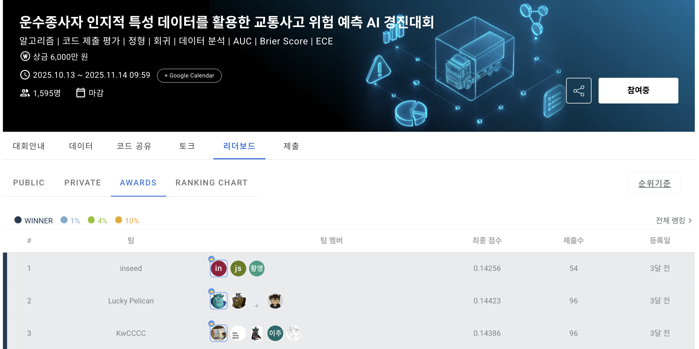
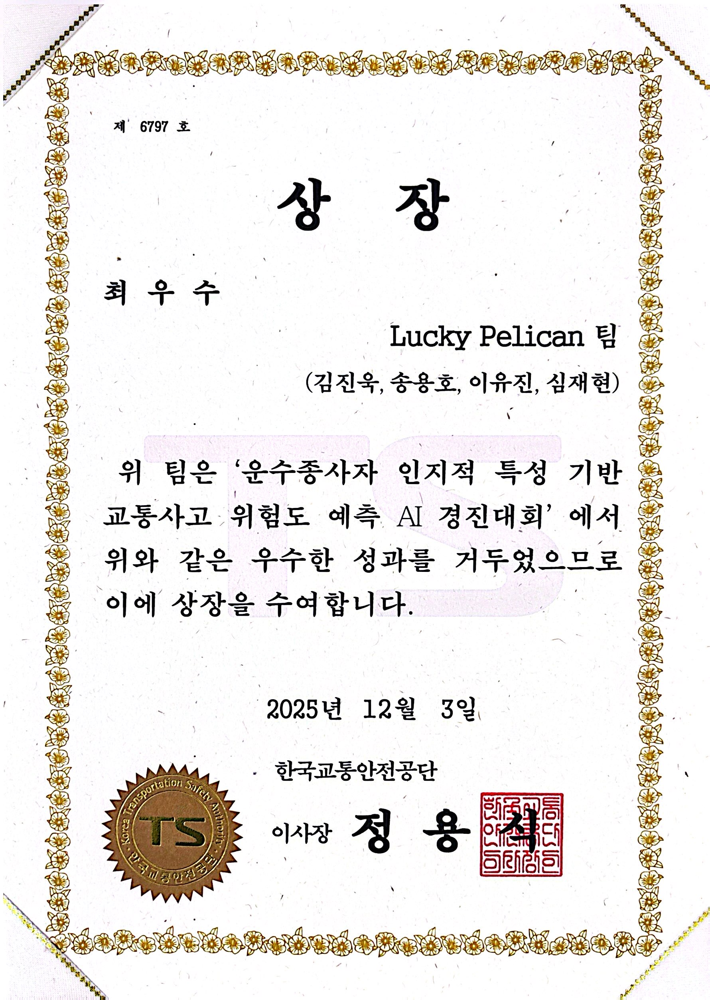

<div align="center">


<br><br>

# Traffic Accident Risk Prediction

### Using Cognitive Characteristics of Commercial Drivers

<br>

[](https://python.org)
[](https://xgboost.readthedocs.io)
[](https://catboost.ai)
[](https://scikit-learn.org)
[](https://pytorch.org)
[](https://pandas.pydata.org)
[](https://numpy.org)
[](https://optuna.org)
[](https://shap.readthedocs.io)

<br>

> 운수종사자(버스/택시/화물 기사)의 **인지 반응 검사 데이터**로 **교통사고 위험도**를 예측하는 이진 분류 시스템
> **핵심 질문:** *"시험 점수를 아무리 개선해도 위험군에서 벗어날 수 없다면, 이 검사는 공정한가?"*

**Dacon AI Competition | 6,000만원 상금 | 1,595명 참가 | 주최: 행정안전부 · NIA · 한국교통안전공단**

</div>

---

## Competition Result

<table>
<tr>
<td width="65%" align="center">



</td>
<td width="35%" align="center">



**Best Excellence Award (최우수상)**<br>
한국교통안전공단

</td>
</tr>
</table>

<div align="center">

| Metric | Value |
|--------|-------|
| **Final Rank** | **3rd / 1,595 teams** |
| **Final Score** | **0.14386** (lower is better) |
| **Prize** | **Best Excellence Award (최우수상)** |
| Team | Lucky Pelican (김진욱, 송용호, 이유진, 심재현) |
| Data Scale | A: 647,241 + B: 297,526 (~100만 건) |

</div>

---

## Problem Statement

운전자격정밀검사(사업용 차량 운전자 대상) 데이터를 활용하여 **교통사고 위험군을 이진 분류**(0=정상, 1=위험)하는 문제입니다.

검사는 두 유형으로 구분됩니다:

| | Test A (인지 반응 검사) | Test B (운전적성 종합 검사) |
|--|--|--|
| **구조** | Trial 시퀀스 기반 (시행별 반응속도) | 인지기능 종합 평가 |
| **하위검사** | A1~A9 (9개) | B1~B10 (10개) |
| **측정 내용** | 단순반응, 선택반응, 주의력, 간섭(Stroop), 변화탐지 | 시야, 신호등, 화살표(Flanker), 길찾기, 표지판, 추적, 이중/삼중과제 |
| **데이터 규모** | 647,241건 | 297,526건 |

### Evaluation Metric

$$\text{Score} = 0.5 \times (1 - \text{AUC}) + 0.25 \times \text{Brier} + 0.25 \times \text{ECE}$$

> 낮을수록 좋은 점수. **판별력(AUC)**과 **확률 보정(Brier, ECE)**을 동시에 요구하는 지표

---

## Key Insight: The Immutable Variable Dilemma

> **"자동차 보험료는 나이와 사고 이력에 따라 결정된다. 이 두 변수가 사고를 설명하는 가장 강력한 예측 요인이다."**

본 팀이 성능을 크게 향상시킨 **핵심 인사이트**는 데이터를 두 가지로 명확히 분리한 것입니다:

<table>
<tr>
<td width="50%" align="center">

### Mutable Variables (가변)

단기간에 **변화 가능**하거나<br>
개인의 인지·주의력 상태를 반영

`B1~B10 검사 결과`<br>
`A1~A9 반응 시퀀스`

</td>
<td width="50%" align="center">

### Immutable Variables (불변)

쉽게 **변하지 않는**<br>
안정적인 인적 정보

`Age (연령대)`<br>
`Category (운수업종)`<br>
`Past_Label (과거 사고 이력)`

</td>
</tr>
</table>

**Feature Importance 분석 결과:**

| Model | 불변 변수 기여도 | 가변 변수 기여도 |
|:-----:|:--------------:|:--------------:|
| **Model A** (XGBoost) | ~70% | ~30% |
| **Model B** (CatBoost) | ~95% | ~5% |

> 불변 변수가 예측의 대부분을 지배합니다. 이는 **"시험 점수를 아무리 개선해도 위험군에서 벗어나기 어려운"** 구조적 문제를 의미합니다.

---

## Novelty: Mathematical Proof of Structural Limitation

> *왜 시험 점수를 극단적으로 개선해도 위험 확률이 충분히 낮아지지 않는가?*

### Sigmoid의 Lipschitz 상수에 의한 확률 변화량의 상한

이진 분류 확률 모델에서 logit은 불변/가변 변수의 기여로 분해됩니다:

$$p(z,w) = \sigma\big(A(z) + B(w)\big)$$

> $z$: 불변 변수, $w$: 가변 변수, $A(z)$: 불변 logit 기여, $B(w)$: 가변 logit 기여

Sigmoid 도함수의 **최대값이 0.25**라는 성질과 평균값 정리를 결합하면:

$$|p(z, w_2) - p(z, w_1)| \leq 0.25 \cdot |B(w_2) - B(w_1)|$$

OOF 데이터에서 그리드 서치를 통해 $\Delta B \approx 0.261$을 관측한 결과:

$$|\Delta p|_{\max} \approx 0.065$$

> **시험 점수를 극단적으로 개선해도 위험도 변화량은 약 6.5%를 넘을 수 없다.** 이는 log-loss 기반의 모든 확률 모델(GBDT, MLP 포함)에서 동일하게 발생하는 **구조적 현상**입니다.

### 실증: 고위험군 재시험 시뮬레이션

| | Before | After (가변 변수 최적화) | 변화 |
|--|:------:|:-----:|:-----:|
| **위험도** | 0.6758 | 0.6146 | -9.1% |
| **목표 (저위험)** | - | 0.02 | **도달 불가** |

---

## Proposed Solutions: Three Principles for Fairness

본 모델이 실무에 적용되려면 **세 가지 원칙**이 충족되어야 합니다:

1. **공정성** — 모든 시험자는 재시험 시 합격 가능성을 얻어야 한다
2. **설명 가능성** — 불합격 사유를 납득 가능하게 설명할 수 있어야 한다
3. **성능** — 위 두 조건을 만족하면서 높은 판별력을 유지해야 한다

### Solution 1: 인적 판별자와의 결합

```
모델 출력: 전체 위험도(불변 포함) + 시험 기반 개선 방향(가변 중심)
    ↓
최종 판단: 전문가가 시험 정보 중심으로 판단
```

### Solution 2: 불변변수를 우회하는 구조적 모델링

```
전체 데이터 → 불변 변수로 그룹 분할 → 각 그룹 내 가변 변수만으로 학습
    ↓
그룹별 다른 threshold 설정 → 공정성 확보
```

---

## Technical Architecture

### Dual-Model Design

```
┌─────────────────────────────────────────────────────────┐
│                    Raw Test Data                         │
├──────────────────────┬──────────────────────────────────┤
│                      │                                   │
│  Test A (시퀀스)      │  Test B (종합평가)                  │
│  647,241건           │  297,526건                         │
│                      │                                   │
│  ┌─────────────┐     │  ┌──────────────────────────┐     │
│  │ pre_a.py    │     │  │ preprocess_b_pca_pipeline │     │
│  │ 115 features│     │  │ 222 → 51 PCA + 31 meta   │     │
│  └──────┬──────┘     │  └───────────┬──────────────┘     │
│         │            │              │                     │
│  ┌──────▼──────┐     │  ┌───────────▼──────────────┐     │
│  │  XGBoost    │     │  │       CatBoost            │     │
│  │  5-Fold CV  │◄────┼──│  Native Categorical       │     │
│  └──────┬──────┘     │  └───────────┬──────────────┘     │
│         │    A↔B 교차 정보 공유       │                     │
│         │            │              │                     │
│         └──────┬─────┴──────────────┘                     │
│                ▼                                          │
│         Final Prediction                                  │
└─────────────────────────────────────────────────────────┘
```

### 11 Models Compared → Best 2 Selected

| Model | A AUC | B AUC | |
|-------|:-----:|:-----:|--|
| SVM | ~0.55 | ~0.58 | |
| KNN | ~0.57 | ~0.60 | |
| Random Forest | ~0.68 | ~0.76 | |
| **XGBoost** | **0.7213** | 0.7912 | **← A 최고** |
| LightGBM | 0.7195 | 0.7920 | |
| **CatBoost** | 0.7148 | **0.7943** | **← B 최고** |
| TabNet | ~0.68 | ~0.75 | |
| TabPFN | ~0.66 | ~0.72 | |
| MLP | ~0.67 | ~0.74 | |

---

## Feature Engineering Novelties

### Novelty 1: Asymmetric Risk Weighting Function

반응속도는 0(정확한 반응)에서 멀어질수록 위험이 증가하지만, 그 증가 속도는 **비대칭적**입니다:

| 반응 유형 | 함수 | 근거 |
|:---------:|:----:|------|
| **지연 반응 (+)** | **Exponential** | 졸음·주의 저하·인지 부하 → 가장 치명적 |
| **조기 반응 (-)** | **Logarithmic** | 위험하지만 지연만큼 급격하지 않음 |
| **정확 반응 (0)** | Baseline | 가장 안전한 패턴 |

### Novelty 2: Domain-Specific PCA (12 Independent PCAs)

전체 피처를 단일 PCA로 압축하지 않고, **검사 도메인별로 독립적인 PCA**를 적용합니다. 각 검사가 독립적인 인지 기능을 측정하기 때문에, 다른 도메인의 분산이 혼합되면 의미 있는 주성분이 왜곡됩니다.

| PCA Group | Raw Features | Components | Explained |
|:---------:|:------------:|:----------:|:---------:|
| B1/B2 시야 | 23 | 3 | 62.8% |
| B3 신호등 | 18 | 4 | 83.2% |
| B4 Stroop | 20 | 5 | - |
| B5 길찾기 | 43 | 7 | 90.9% |
| B6/B7 표지판 | 6 | 1 | 64.2% |
| B8 추적 | 37 | 8 | 99.3% |
| B9/B10 복합과제 | 75 | 23 | - |
| **Total** | **222** | **51** | **77% 압축** |

### Novelty 3: Signal Detection Theory (SDT) for B9/B10

이중/삼중 과제 검사에서 **신호탐지론 지표**로 운전자의 인지 특성을 정량화합니다:

$$d' = \Phi^{-1}(\text{Hit Rate}) - \Phi^{-1}(\text{False Alarm Rate})$$

| Metric | Description |
|--------|-------------|
| $d'$ (민감도) | 신호와 소음을 구별하는 능력 |
| $c$ (기준) | 응답 편향 (보수적/진보적) |
| Hit Rate | 신호 존재 시 정확 탐지율 |
| FA Rate | 신호 부재 시 오탐율 |

### Novelty 4: 1D CNN Sequence Pattern Extraction

A 검사의 trial 시퀀스에서 단순 통계로는 파악하기 어려운 **행동 패턴**을 추출합니다:

```
Trial Sequence → Conv1D(16) → Conv1D(32) → GlobalAvgPool → Dense(8) → 2D Embedding
```

> 2차원을 선택한 이유: 3차원 이상에서는 추론 시간이 30분을 초과하여 제출 불가

### Novelty 5: Markov Label Transition Features

동일 운전자의 과거 라벨 전이 패턴을 **Markov chain** 개념으로 특징화합니다:

| Transition | Meaning | Interpretation |
|:----------:|---------|----------------|
| 0 → 0 | 지속 안전 | 안정적 안전 운전자 |
| 0 → 1 | 위험 전환 | 악화 신호 |
| 1 → 0 | 안전 전환 | 개선/회복 |
| 1 → 1 | 지속 위험 | 고위험 반복군 |

### Novelty 6: Cross-Test Information Sharing

A 모델과 B 모델이 **독립적이지만 상호 정보를 교환**합니다:

| Feature | Direction | Description |
|---------|:---------:|-------------|
| `b_previous_label` | B → A | B 검사의 과거 라벨 |
| `primary_past_label` | A → A | 이전 A 검사 라벨 |
| `past_A_history` | A → B | A 검사 이력 카테고리 |
| `pk_dict` (16 features) | A → B | 시계열 이력 (성공률, 스트릭, 추세, 모멘텀 등) |

### Novelty 7: Cross-Label History (Data Leakage Prevention)

5-Fold CV 내에서 **학습 데이터를 절반씩 분할하여 교차 매핑**함으로써, 과거 이력 정보의 예측력을 활용하면서도 라벨 누수를 완전 차단합니다:

```
Train Fold → split → Half_1   Half_2
                      │          │
                      ▼          ▼
              hist_2로 매핑  hist_1로 매핑
                      │          │
                      └────┬─────┘
                           ▼
                    Merged Train Data (No Leakage)
```

---

## Key Findings from Data Analysis

### 학습 효과: 과거 검사 경험이 연령 효과를 상쇄

| Past_Label | 60대 B2 Score | 70대 후반 B2 Score | 감소폭 |
|:----------:|:------------:|:-----------------:|:-----:|
| 기록없음 (-1) | 23.93 | 17.30 | **-27.7%** |
| 과거사고 (1) | 23.13 | 22.00 | **-4.9%** |

> 과거 검사 경험이 있는 운전자는 연령 증가에 따른 인지 점수 하락이 **약 5배 작음**

### 업종별 역설: 높은 점수 ≠ 낮은 사고율

| Category | B3 정확도 | 사고율 |
|:--------:|:--------:|:-----:|
| 택시 | 높음 (9.29) | **6.21%** |
| 화물 | 낮음 (9.31과 유사) | **3.27%** |

> 사고 위험도는 단순 시험 점수가 아닌, **운전 환경·운행 패턴·업무 특성**에 크게 좌우됨

### 라벨 일관성: 안전 운전자는 계속 안전

| 검사 간격 | 라벨 동일 비율 | 0→0 유지율 |
|:---------:|:------------:|:---------:|
| 0~3개월 | 94.5% | **99.9%** |
| 12~18개월 | 87.5% | **97.7%** |
| 24~36개월 | 82.9% | **94.8%** |

> 한 번 안전(0)으로 분류된 운전자는 **97% 이상** 다음에도 안전을 유지

---

## Explainability: 4-Panel Visualization

| Panel | Description |
|:-----:|-------------|
| **좌상** | 시험 결과가 예측에 기여한 정도 (Mutable Feature SHAP) |
| **우상** | 위험도를 낮추기 위한 구체적 개선 목표값 (Current vs Target) |
| **좌하** | 개선 시 위험도 감소 시뮬레이션 (예: -28.7% 감소 방향) |
| **우하** | 전체 피처 영향력 종합 (All Features SHAP Top 20) |

> 가변 변수 중심의 개선 방향을 제시하여, 수검자가 **어떤 부분을 보완해야 하는지** 명확히 이해할 수 있도록 함

---

## Tech Stack

| Category | Tool | Version | Role |
|----------|------|---------|------|
| **GBDT** | XGBoost | 2.1.1 | Model A (5-Fold CV) |
| **GBDT** | CatBoost | 1.2.3 | Model B (Native Categorical) |
| **ML** | scikit-learn | 1.7.2 | PCA, StandardScaler, KFold, Metrics |
| **DL** | PyTorch | 2.2.2 | 1D CNN AutoEncoder |
| **HPO** | Optuna | 4.1.0 | 하이퍼파라미터 300회 탐색 |
| **XAI** | SHAP | 0.46.0 | 피처 중요도 & 설명 가능성 |
| **Data** | pandas | 2.3.3 | DataFrame 처리 |
| **Numeric** | NumPy | 1.23.5 | 수치 연산, Vectorized SDT |
| **Stats** | SciPy | - | norm.ppf (SDT d' 계산) |

---

## Quick Start

```bash
# 1. Setup
pip install -r requirements.txt

# 2. Train Model A (XGBoost, 5-Fold CV)
python scripts/train_model_a.py

# 3. Train Model B (CatBoost)
python scripts/train_model_b.py
```

---

## Project Structure

```
.
├── assets/                          # README 이미지
│   ├── leaderboard.png
│   ├── cover.png
│   └── award_certificate.jpg
│
├── scripts/                         # 실행 스크립트
│   ├── train_model_a.py             #   Model A (XGBoost, 5-Fold CV)
│   ├── train_model_b.py             #   Model B (CatBoost + PCA)
│   ├── train_model_b_retention.py   #   Model B 변형 (라벨 유지율)
│   ├── train_model_b_temporal.py    #   Model B 변형 (시간 피처)
│   └── preprocessing/               #   전처리 모듈
│       ├── preprocess_test_a.py     #     Test A (1,684 lines)
│       ├── preprocess_test_b.py     #     Test B 기본 피처
│       ├── preprocess_b_pca_pipeline.py  # PCA 차원축소
│       ├── preprocess_b_vectorized.py    # B9/B10 벡터화
│       ├── preprocess_cnn_encoder.py     # 1D CNN 피처
│       └── driver_history_features.py    # 시계열 이력 (17개)
│
├── models/                          # 학습된 모델
│   ├── model_a/                     #   XGBoost 5-Fold (.json)
│   ├── model_b/                     #   CatBoost (.cbm) + 아티팩트
│   └── pk_dict.pkl                  #   운전자 이력 딕셔너리
│
├── docs/                            # 문서
│   ├── model_development_report.hwp #   모델 개발 보고서 (43p)
│   └── data_analysis_report.hwp     #   데이터 분석 보고서 (52p)
│
├── requirements.txt
└── .gitignore
```

---

## References

1. T. Chen & C. Guestrin. *XGBoost: A Scalable Tree Boosting System.* KDD, 2016.
2. A. V. Dorogush et al. *CatBoost: Gradient Boosting with Categorical Features Support.* NeurIPS, 2018.
3. D. M. Green & J. A. Swets. *Signal Detection Theory and Psychophysics.* Wiley, 1966.
4. T. Akiba et al. *Optuna: A Next-generation Hyperparameter Optimization Framework.* KDD, 2019.
5. S. M. Lundberg & S. I. Lee. *A Unified Approach to Interpreting Model Predictions (SHAP).* NeurIPS, 2017.
6. Dacon. 운수종사자 인지적 특성 데이터를 활용한 교통사고 위험 예측 AI 경진대회. https://dacon.io/competitions/official/236564
